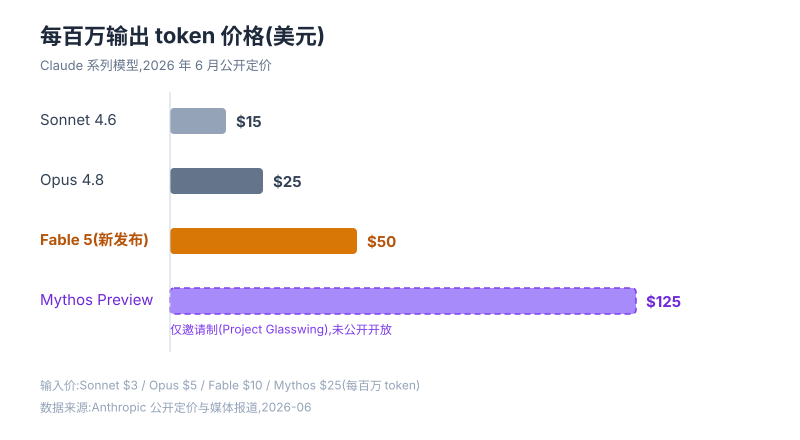
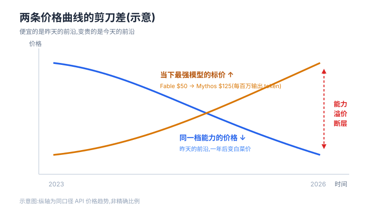

6 月 23 日早上,很多人的 Claude 订阅里会发生一件小事:那个最聪明的模型,从"包含在套餐里"变成"请购买用量额度"。

6 月 9 日,Anthropic 发布了 Fable 5——第一个把 Mythos 级能力开放给公众的模型。API 定价 $10 / $50(每百万输入 / 输出 token),是 Opus 4.8 的整整两倍,媒体的说法是"全球在售大模型里最贵的一个"。Pro、Max 这些订阅计划可以免费用到 6 月 22 日,像一场为期两周的试吃;6 月 23 日起,它被从订阅里拿出来,单独计费。

很多人的第一反应是抱怨:AI 不是应该越来越便宜吗?怎么反着来了?

我的看法是:**"AI 越来越便宜"和"AI 越来越贵",第一次同时为真。** 而且这两件事不矛盾——它们说的根本不是同一个东西。

## 一、先看清价格表上真正发生了什么

把 Claude 系列摆在一起,断层一目了然:

注意两个细节。

第一,**便宜的那一头其实在变得更便宜**。Opus 4.8 带着 100 万 token 上下文,只卖 $5 / $25——放在两年前,这个能力水平的模型敢标三倍价钱。昨天的"贵到肉疼的前沿",今天是人人用得起的日常款。

第二,**贵的那一头在重新变贵**。Fable 5 标 $50,它上面还有个邀请制的 Mythos Preview,$125。价格阶梯不是平缓的坡,是悬崖。

把时间轴拉开,你会看到两条方向相反的曲线:

向下的那条线,是"同一档能力"的价格——技术扩散、推理优化、竞争压价,旧前沿一年后变白菜价,这条线还会一直跌。向上的那条线,是"当下最强"的标价——每一代新前沿,都比上一代敢要更高的价。

**便宜的是昨天的前沿,变贵的是今天的前沿。**两条线之间张开的口子,我叫它"能力溢价断层"。

## 二、比涨价更重要的,是收费方式变了

$50 这个数字其实不是这次最大的新闻。最大的新闻是那个日期:6 月 23 日。

订阅制的潜台词是"吃到饱"——你付一笔月费,智能随便用,用多用少一个价。把 Fable 5 从订阅里拿出来、改成按用量买额度,意味着前沿智能的商品形态变了:**从自助餐,变成了按表计费的公用事业。**像电,像水,像云计算的算力——用多少,付多少。

这个转变眼熟吗?电力刚出现的时候也是奢侈品,只有工厂和富人用得起;真正改变世界,是在它变成"计量收费的基础设施"之后。**一个东西开始按表计费,恰恰说明它进入了经济的毛细血管——市场终于给它标出了价格,而不是把它当赠品。**

所以"AI 越来越贵"不是泡沫信号,反而是落地信号。赠品没有价格,工具才有。

## 三、断层的两边,站着两种人

价格断层一旦张开,它就不只是个财务问题了。

对公司,模型选型第一次变成了真金白银的取舍:什么活配 Sonnet,什么活值得烧 Fable,"无脑用最好的"不再是默认选项。会有人专门去算"每 token 产出"——这个岗位以前不存在。

对个人,事情更微妙。以前你和别人用的是同一个模型,差距在 prompt 和判断力;现在,**愿意为前沿付费的人,手里的工具就是比你的聪明一截,而且这截差距有明确的标价。**智能差距第一次可以用美元度量。付得起的人先拿到复利,复利又让他们更付得起——断层两边的距离,默认是越拉越大的。

这听起来残酷,但有一个好消息藏在向下的那条曲线里:**今天你付不起的 Fable,大概率就是明年的日常款。**断层不会消失,但断层的位置一直在向上移——你脚下的地板,其实也在升。

## 四、该问的不是"贵不贵"

所以回到那句抱怨:AI 怎么越来越贵了?

我觉得问错了。电费没人嫌贵,因为没人怀疑电创造的价值远超电费。AI 按表计费之后,真正的问题变成:**你用它产出的价值,能不能跑赢它的价格?**

如果你拿 Fable 5 写周报,$50 一百万 token 确实贵得离谱;如果你拿它做一个人顶一个小团队的事,这是全市场最便宜的劳动力。贵的从来不是模型,是"用最贵的工具干最便宜的活"。

AI 越来越好,也越来越贵。前半句决定了你必须用它,后半句决定了你必须算账。两条曲线还会继续张开——而你唯一能选的,是站在断层的哪一边。
